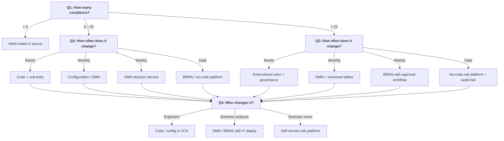

## 11. Pattern Selection & Decision Frameworks

The preceding chapters presented five pattern categories, composability rules, metrics, and testing strategies. This chapter delivers the decision tool: a practical framework for selecting the right pattern at the right time. Pattern selection is not a matter of taste or trend adoption — it is a function of three variables you can assess in minutes. Misalignment between pattern and context produces the over-engineered flag system and the under-engineered tax engine with equal inevitability.

### 11.1 The Pattern Selection Decision Tree

The decision tree below condenses Capital One's complexity × rate-of-change framework [^266^], Gartner's pace-layered strategy [^639^], and the policy-mechanism separation principle [^682^] into three questions that resolve any pattern-selection dilemma.

#### 11.1.1 Entry Question: How Many Conditions?

The condition count is the strongest single predictor of implementation approach. Below five conditions, the overhead of any pattern exceeds its value. Hard-coded logic with clear naming and unit tests is the correct choice; extracting it into a rule engine introduces accidental complexity. Between five and twenty conditions, structural patterns pay off: the Specification pattern for validation, the Strategy pattern for routing, decision tables for branching logic. Above twenty conditions, externalization becomes obligatory — not because the logic is intellectually unmanageable in code, but because governance requirements emerge. Who changed which rule, when, and why becomes a question regulators and auditors will ask [^135^]. The cognitive load of understanding twenty interdependent conditions in source code exceeds the fifteen-point threshold established in Chapter 9; externalization forces structure that flat code cannot enforce.

#### 11.1.2 Second Question: How Often Does It Change?

Change frequency determines the deployment boundary. Logic that changes rarely — core entity definitions, structural constraints, regulatory foundations that shift on multi-year cycles [^688^] — belongs in compiled code with standard release processes. Monthly changes benefit from configuration or DMN tables that can be updated without code pushes; the twelve deploys per year this enables match the pace of product and marketing cycles. Weekly changes demand DMN decision services with hot-deployment capability; the cost of a full engineering release cycle for fifty-two changes annually exceeds the operational overhead of a decision engine. Daily or intra-day changes require BRMS or no-code platforms that permit business analysts to modify rules through governed workflows without engineering involvement [^645^].

#### 11.1.3 Third Question: Who Changes It?

The change agent determines the interface. Engineers changing logic can work directly in version-controlled code or configuration files. Business analysts need notation they can read and modify — DMN tables, structured YAML — with engineering handling deployment. Business users require self-service platforms with guardrails: pre-approved rule templates, change-request workflows, automatic test execution before activation, and full audit trails [^1013^]. The critical error is giving business users tools that expose too much power without sufficient governance, or forcing business analysts to file engineering tickets for rule changes they make weekly.

### 11.2 The Complexity × Change-Rate Selection Matrix

The decision tree provides a binary path. The matrix below provides the full cartesian product: five logic categories crossed with four change frequencies, producing a recommended implementation pattern for each cell. Capital One's framework [^266^] was the first to systematically map these dimensions; the matrix extends it across all five categories from Chapter 2.

| Logic Category | Rarely (years) | Monthly | Weekly | Daily or intra-day |
|:---|:---|:---|:---|:---|
| Validation | Schema constraints, type systems | Specification pattern, config-driven rules | Configurable validator engine with hot reload | Self-service rule platform with sandbox testing |
| Routing | Strategy pattern, compile-time dispatch | Feature flags with expiry [^643^] | DMN decision tables for path selection | Dynamic router with real-time rule push |
| Orchestration | Saga pattern in code, durable execution | Temporal / workflow engine with versioned definitions | BPMN + DMN hybrid for task routing | Low-code orchestration with citizen developer UI |
| Calculation | Versioned formula library, externalized rates | Parameterized engine, DMN for tier lookups | DMN decision service with table updates | BRMS with approval workflow and audit trail |
| Decision mgmt | Structured rule documents, code implementation | DMN with DRD for dependency mapping | BRMS with governance and test automation | No-code rule platform, real-time simulation |

*Table 11.1 — Complexity × Change-Rate Selection Matrix. Rows are logic categories from Chapter 2; columns are change frequency. Each cell recommends the implementation pattern minimizing total cost of change.*

The matrix reveals patterns invisible in the binary tree. Validation logic changing weekly or daily is a strong signal that the domain boundary is wrong: either the validation rules belong to a different bounded context with higher change autonomy, or the "validation" is actually decision logic masquerading as input checking. Routing logic changing daily should trigger alarm — it indicates the service is being used as a configuration layer rather than an architectural component, the feature-flag anti-pattern flagged in Chapter 4 [^643^]. Decision management changing rarely is equally suspicious: it suggests the organization is not getting business value from a rule category that should be actively tuned.

#### 11.2.1 Override Conditions

The matrix provides the default; three conditions justify deviation. First, team expertise: a team with deep DMN experience may prefer decision tables for monthly-changing validation where the matrix recommends Specification pattern. Second, regulatory requirements: SOX, Solvency II, and IFRS 17 mandate audit trails and segregation of duties that push logic rightward on the frequency axis — toward more externalized, governed platforms even when change frequency would suggest simpler patterns. Third, performance constraints: a validation engine handling 100,000 requests per second may need compiled code even for weekly changes, with hot-reload through a sidecar pattern rather than a full BRMS.

### 11.3 Organizational Alignment Check

Pattern selection without organizational alignment produces architectures that work on whiteboards and fail in production. The socio-technical dimension is not secondary — it is primary.

#### 11.3.1 Conway's Law as Design Constraint

Martin Fowler observed that "Conway's Law is important enough to affect every system I've come across" [^375^]. The law — that organizations design systems mirroring their communication structures — is not an observation to work around but a constraint to design with. A routing engine owned by three teams with misaligned roadmaps will accumulate the distributed-monolith pathologies described in Chapter 9 regardless of which pattern the matrix recommends. The pattern selection is valid only when the ownership structure supports it.

#### 11.3.2 The Inverse Conway Maneuver

The Inverse Conway Maneuver flips the relationship: instead of accepting organizational structure as given and watching architecture conform, structure teams around the desired bounded contexts [^1215^]. Amazon's two-pizza teams were not a management fad — they were the organizational prerequisite for service-oriented architecture. Each team owned a bounded context end to end: code, data, and operational responsibility [^1249^][^1254^]. The result was autonomous teams with minimal cross-team coordination — the communication structure that produces clean architectural boundaries.

Applied to pattern selection: before implementing the matrix's recommendation, verify that a single team can own the logic end to end. If the recommended pattern spans three teams' responsibilities, either restructure the teams or choose a pattern that matches current ownership. Ignoring this constraint produces the shared-kernel anti-pattern — "organizational glue that hardens into concrete" — where multiple teams depend on a common model with conflicting evolution priorities.

#### 11.3.3 Team Structure Matrix

Three team structures map to different logic categories with different success profiles. Table 11.2 connects structure to category.

| Team Structure | Definition | Best Suited For | Anti-Pattern Risk |
|:---|:---|:---|:---|
| Feature teams | Cross-functional team owns vertical slice (UI to data) | Routing, validation tied to user-facing features | Inconsistent validation rules across features; duplicated decision logic |
| Component teams | Team owns a technical layer or shared service | Calculation engines, shared validation libraries | Slow response to feature needs; "platform team bottleneck" |
| Platform teams | Team owns infrastructure and developer tooling | Orchestration frameworks, BRMS infrastructure | Building generic solutions for specific problems; under-utilized platforms |

*Table 11.2 — Team Structure Alignment Matrix. Structure determines which logic categories a team can own effectively.*

Feature teams excel at validation and routing logic that changes with product requirements — the team feels user pain directly and prioritizes accordingly. The risk is inconsistency: five feature teams each implementing discount validation produces five slightly different rules. Component teams owning calculation engines and shared libraries enforce consistency but become bottlenecks when every feature team queues for their roadmap time. Shopify's modular monolith [^1293^] — with components like `checkout`, `billing`, and `orders` each owned by dedicated teams — represents a hybrid: component-like ownership within a unified deployment unit, avoiding both the inconsistency of pure feature teams and the latency of separate services.

Platform teams building orchestration infrastructure or BRMS platforms face the "build it and they may not come" risk. Netflix built Conductor because choreography became unmanageable as team count grew [^902^] — the platform emerged from demonstrated pain, not anticipated need. The pattern selection matrix is valid only when the team structure can support the chosen pattern's ownership model. Decision management requiring daily business-user changes needs a platform team maintaining the rule infrastructure; without that platform team, the pattern fails regardless of its technical merits.

The three questions of the decision tree, the matrix cells, and the team structure alignment together form a complete selection framework. Apply the tree for quick decisions, the matrix for thoroughness, and the organizational check for feasibility. A pattern that is technically correct but organizationally unsupported will be replaced within two years — Lehman's Second Law guarantees it [^688^].

---